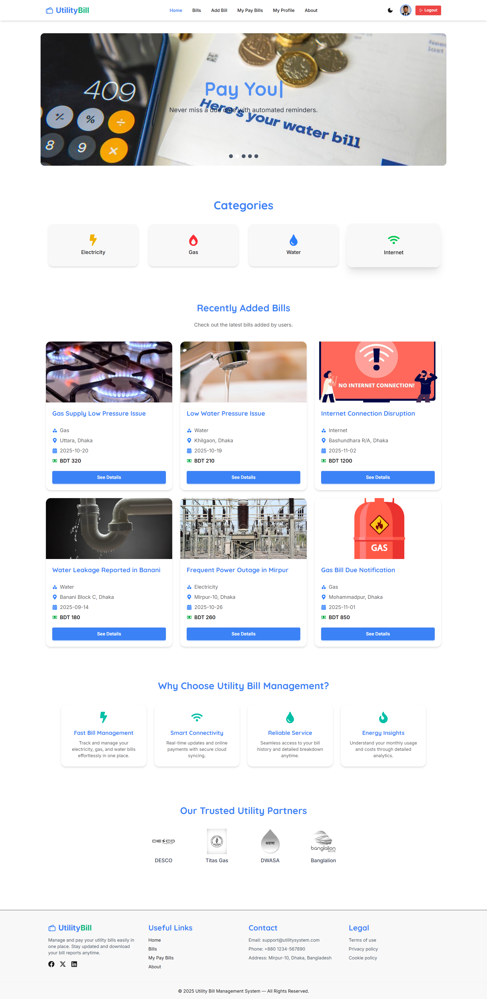

# 🧾 UtilityBill 

A complete **full-stack web application** built with the **MERN Stack (MongoDB, Express, React, Node.js)** that allows users to **manage, pay, and track their utility bills** from one place — all with a modern UI and smooth experience.
 

---

## 🌐 Live Site

🔗 **[Visit Live Site](https://utility-bills-cfa.netlify.app)**  


---

## ⚙️ Tech Stack

### 🖥️ Frontend

| Technology                                                                                                              | Description                | Badge                           |
| ----------------------------------------------------------------------------------------------------------------------- | -------------------------- | ------------------------------- |
|                        | Component-based UI library | ⚛️ Build interactive interfaces |
|    | Routing                    | 🔁 SPA navigation               |
|     | Styling                    | 🎨 Modern utility-first CSS     |
|                   | UI Components              | 🌸 Prebuilt Tailwind components |
|       | Alerts                     | 💬 Modern popup notifications   |
|                    | PDF Generation             | 📄 Export user reports          |
|                         | HTTP Client                | ⚙️ API requests handling        |
|        | Animation                  | ✨ Page transitions             |
|                       | Animation                  | 🎬 Interactive effects          |
|     | Toasts                     | 🔔 Success/error messages       |
|  | Text Animation             | 🖋️ Typing effects               |
|             | Icons                      | 🎯 Modern icon set              |

---

### ⚙️ Backend

| Technology                                                                                                   | Description | Badge                        |
| ------------------------------------------------------------------------------------------------------------ | ----------- | ---------------------------- |
|        | Runtime     | 🟢 JavaScript backend engine |
|  | Framework   | ⚙️ REST API creation         |
|        | Database    | 🗄️ Data storage              |

---

### 🔐 Authentication

| Tech                                                                                                      | Description    | Badge                        |
| --------------------------------------------------------------------------------------------------------- | -------------- | ---------------------------- |
|  | Authentication | 🔑 Secure Email/Google Login |

---

### ☁️ Hosting

| Service                                                                                                | Role           | Badge                  |
| ------------------------------------------------------------------------------------------------------ | -------------- | ---------------------- |
|  | Client Hosting | 🌍 Frontend deployment |
|     | Server Hosting | ⚙️ Backend deployment  |

---

## ✨ Features

- 🔐 **User Authentication System**  
  Secure login, registration, and Google social authentication using Firebase.

- 🧾 **Bill Management Dashboard**  
  Add, view, and manage all utility bills (Electricity, Gas, Water, Internet) with CRUD operations.

- 💳 **Online Bill Payment**  
  Users can pay their current month’s bills directly from the details page with a confirmation form.

- 📄 **PDF Report Generation**  
  Generate and download a personalized payment report with total count and total amount using jsPDF.

- 🎨 **Responsive Modern UI**  
  Fully responsive layout with Navbar, Footer, Category cards, Carousel, and extra informative sections.

- 🧑‍💼 **User Profile Management**  
  View and update your name and photo instantly from the Profile page.

- ⚡ **Category Filtering and Details**  
  Filter bills by category and view complete information with an option to pay.

---

## 📂 Pages Overview

| Page                 | Description                                                                  |
| -------------------- | ---------------------------------------------------------------------------- |
| **Home**             | Carousel, category cards, recent bills, and extra informative sections.      |
| **Bills**            | Displays all bills with filtering by category and “See Details” navigation.  |
| **Bill Details**     | Full information with payment form (available only for current month).       |
| **My Pay Bills**     | Displays logged-in user’s bills with Update/Delete options and PDF download. |
| **About**            | Information about the platform and its purpose.                              |
| **Profile**          | Shows and allows updating of user's display name and profile photo.          |
| **Login / Register** | Authentication pages with Firebase and Google login.                         |
| **404 Page**         | Custom not-found route handling.                                             |

---

## 🧩 Additional Features

- 🌓 Dark/Light Theme Toggle

- 🔁 Smooth Scroll & Animations

- 🎥 Lottie or Framer Motion for UI Effects

- 🔔 Toasts for Success/Error Feedback

- 🔒 Persistent Login State (Private Routes)

---

## 💻 Installation & Setup

Follow these steps to run the project locally:


```bash
1. Clone the repository
git clone https://github.com/jubayer-bd/Utility_Bills_Client_Side.git

2. Navigate to the project directory
cd warmpaws

3. Install dependencies
npm install

4. Configure Firebase Keys
Create a .env.local file in the root folder and add your Firebase credentials:
VITE_apiKey=your_api_key
VITE_authDomain=your_auth_domain
VITE_projectId=your_project_id
VITE_storageBucket=your_storage_bucket
VITE_messagingSenderId=your_messaging_sender_id
VITE_appId=your_app_id

5. Start the server
npm run dev

---

## 🧾 MongoDB Collections

### **bills**

```json
{
  "title": "Frequent Power Outage in Mirpur",
  "category": "Electricity",
  "amount": 1500,
  "location": "Mirpur-10, Dhaka",
  "description": "Power cuts occur daily in the evening.",
  "image": "https://example.com/power.jpg",
  "date": "2025-11-01"
}

{
  "email": "user@gmail.com",
  "billId": "674e5f...",
  "username": "Jubayer",
  "address": "Mirpur, Dhaka",
  "phone": "017XXXXXXXX",
  "amount": 1200,
  "date": "2025-11-08"
}

---

```
